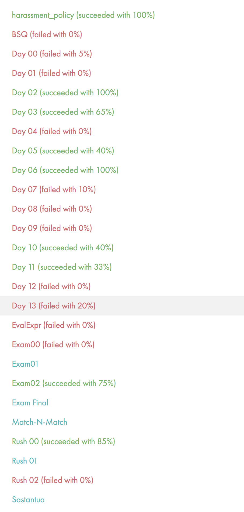

# 42-piscene

Admissions Bootcamp assignments for several weeks 

Grades are attached below, I missed several days as well

Update: This was enough to get me into the cadet program (not sure if it is a myth or not that you need to be at least level 1 to enter the cadet program), this is probably true due to the grading

Something noteworthy was I missed BSQ due to a small issue printing out newlines to stderror instead of stdout so that the output was not properly redirected. The diff was only one new line.
I got 100% on the functional tests. 

```basic_tests: Two parameters KO | functional_tests: OK```


